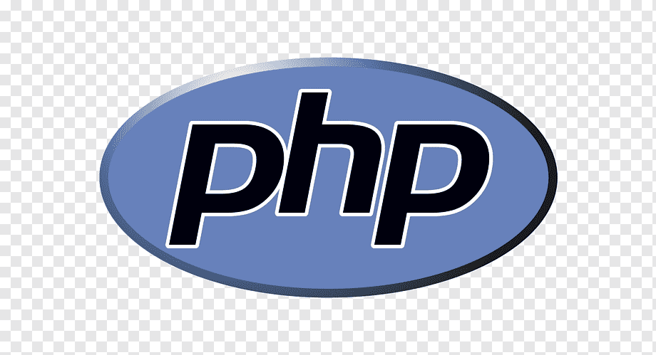

# E-commerce empresa X

Criando **e-commerce** para _empresa x_

## Funcionalidades

_Checkout, **Tela do produto**, Catálogos, Home com banner_

### Linguagens do projeto:

- HTML
- CSS
- JavaScript
- PHP
- MySQL

### Funcionalidades a desenvolver:

1. Área de membros
   - Login diferente para grupos de clientes
   - Desconto especial para grupos de clientes
   - CSS diferente para grupos de clientes
2. Integração com outros pagamentos
3. Sistema de bônus de primeira compra

#### Imagem local

#### Imagem externa

###### Melhorias do projeto:

**Melhoria 1**, _melhoria 2_
